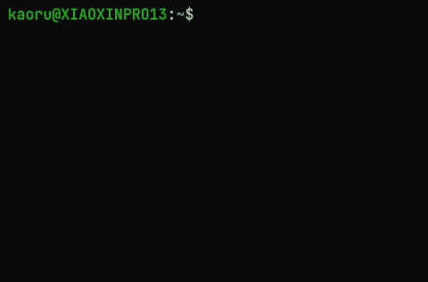

# sese.event

> 跨平台网络事件库

## 开始

编辑 vcpkg-configuration.json，向 registries > package 中添加 sese-event

编辑 vcpkg.json 向项目中添加依赖

```json
{
  "name": "${PROJECT_NAME}",
  "dependencies": [
    "sese-event"
  ]
}
```

查找包并链接到项目中

```cmake
find_package(SString CONFIG REQUIRED)
target_link_libraries(${TARGET} PRIVATE SString::SString)
```

## 可用 Target

- Sese::Event

## BaseEvent 结构

> 基础事件集

此接口一共三个字段，分别为

- fd : <kbd>int</kbd>
  - 此字段用于存放注册的套接字
- event : <kbd>unsigned int</kbd>
  - 此字段用于组合事件的类型
  - EVENT_READ
  - EVENT_WRITE
  - EVENT_ERROR
- data : <kbd>void *</kbd>
  - 此字段用于存放用户自定义数据

## BaseEventLoop 接口

> 此接口供不同平台不同后端实现事件功能

---

> virtual bool init() = 0;

用于初始化事件循环的函数，初始化成功返回 true。

---

> virtual setListenFd(int fd) = 0;

设置当前循环需要监听的套接字文件描述符。每个事件循环对象至多监听一个套接字。设置此选项需要在初始化之前调用。

---

> virtual dispatch(uint32_t timeout) = 0;

分发事件，timeout单位为毫秒，超时将在规定时间内返回。若存在事件，取决于处理事件的具体耗时。

---

> virtual opAccept(int fd) = 0;

当监听的套接字接入新的连接时触发，fd为接收到客户端的套接字。（未设置监听套接字则不会触发）

---

> virtual onRead(BaseEvent *event) = 0;

当设置了 EVENT_READ 事件的套接字可读时触发。

---

> virtual onWrite(BaseEvent *event) = 0;

当设置了 EVENT_WRITE 事件的套接字可写时触发。

---

> virtual onClose(BaseEvent *event) = 0;

当连接的对端套接字关闭时触发。此函数规定只要调用了 createEvent 函数就会自动触发。

!> 不要完全依赖此回调函数来释放资源，非正规的断开连接可能不会触发该函数。

---

> virtual BaseEvent *createEvent(int fd, unsigned int events, void *data) = 0;

为一个套接字创建并注册事件，创建成功返回非空 BaseEvent 指针。

- fd 为注册的套接字
- events 为注册的事件类型
- data 可以是你希望携带的自定义数据

---

> virtual bool setEvent(BaseEvent *event) = 0;

修改一个注册事件的类型。（注意，这通常只能修改 BaseEvent::events 字段）

---

> virtual void freeEvent(BaseEvent *event) = 0;

删除一个事件并释放资源。

## WSAEventLoop 实现

> 此实现为 Windows 下的 EventLoop 默认实现

底层为 WSAEventSelect，支持最大事件监听数 64。（含监听套接字）

## EpollEventLoop 实现

> 此实现为 Linux 下的 EventLoop 默认实现

底层为 epoll，支持最大事件监听数 64。（含监听套接字）

## KqueueEventLoop 实现

> 此实现为 Darwin 下的 EventLoop 默认实现

底层为 kqueue，支持最大事件监听数 64。（含监听套接字）

!> kqueue 的事件是不能组合的，也就意味着同一个套接字组成读写事件需要占用两个事件，所以不推荐监听的套接字数量超过30个。

## 示例 - echo 服务器

> 代码

!> 此示例运行在 **Linux**

```clike
#include "sese/event/Event.h"

#include <atomic>
#include <cassert>
#include <cerrno>
#include <cstdio>
#include <cstring>
#include <thread>

#include <sys/socket.h>
#include <arpa/inet.h>
#include <unistd.h>
#include <fcntl.h>

int setNonblocking(int fd) {
    auto option = fcntl(fd, F_GETFL);
    if (option != -1) {
        return fcntl(fd, F_SETFL, option | O_NONBLOCK);
    } else {
        return -1;
    }
}

class EchoEvent : public sese::event::EventLoop {
public:
    void onAccept(int fd) override {
        if (0 == setNonblocking(fd)) {
            this->createEvent(fd, EVENT_READ, nullptr);
        } else {
            close(fd);
        }
    }

    void onRead(sese::event::BaseEvent *event) override {
        memset(buffer, 0, 1024);
        auto l = read(event->fd, buffer, 1024);
        if (l == -1) {
            if (errno == ENOTCONN) {
                return;
            } else {
                close(event->fd);
                freeEvent(event);
            }
        } else {
            this->size = l;
            event->events &= ~EVENT_READ; // 删除读事件
            event->events |= EVENT_WRITE; // 添加写事件
            setEvent(event);
        }
    }

    void onWrite(sese::event::BaseEvent *event) override {
        write(event->fd, buffer, size);
        ::shutdown(event->fd, SHUT_RDWR);
        close(event->fd);
        freeEvent(event);
    }

    void onClose(sese::event::BaseEvent *event) override {
        freeEvent(event);
    }

public:
    void loop() {
        while (run) {
            dispatch(1000);
        }
    }

    void shutdown() {
        run = false;
    }

protected:
    char buffer[1024]{};
    size_t size = 0;
    std::atomic_bool run{true};
};

int main() {
    sockaddr_in address{};
    inet_pton(AF_INET, "127.0.0.1", &address.sin_addr);
    address.sin_family = AF_INET;
    address.sin_port = htons(8080);

    auto listenSocket = socket(AF_INET, SOCK_STREAM, 0);
    assert(setNonblocking(listenSocket) == 0);
    assert(bind(listenSocket, (sockaddr *) &address, sizeof(address)) == 0);
    listen(listenSocket, 255);

    EchoEvent event;
    event.setListenFd(listenSocket);
    assert(event.init() == true);

    std::thread th([&event]() {
        event.loop();
    });

    getchar();

    event.shutdown();
    th.join();
    return 0;
}
```

> 效果



## 开发和调试

开发和调试该项目需要启用额外选项

> -DSESE_EVENT_BUILD_TEST:BOOL=TRUE
>
> -DVCPKG_MANIFEST_FEATURES:STRING=tests